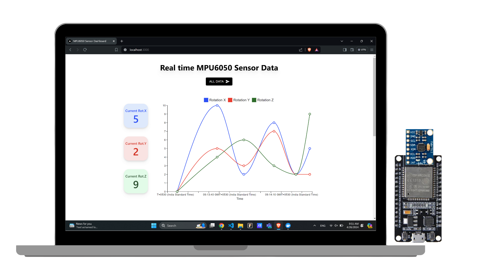
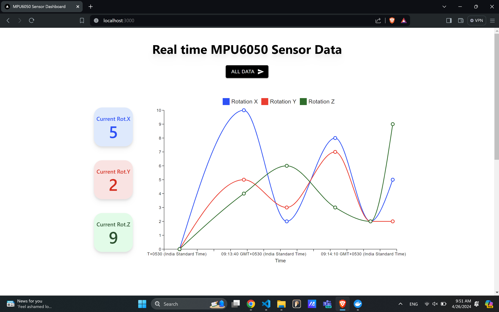
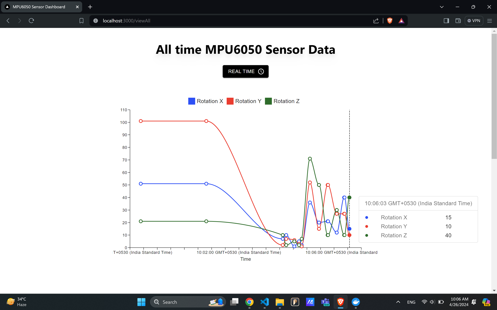
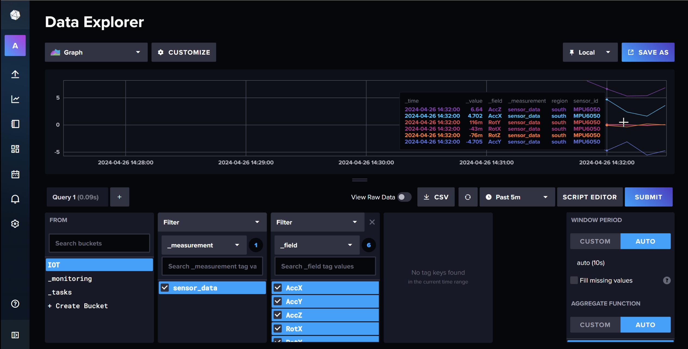
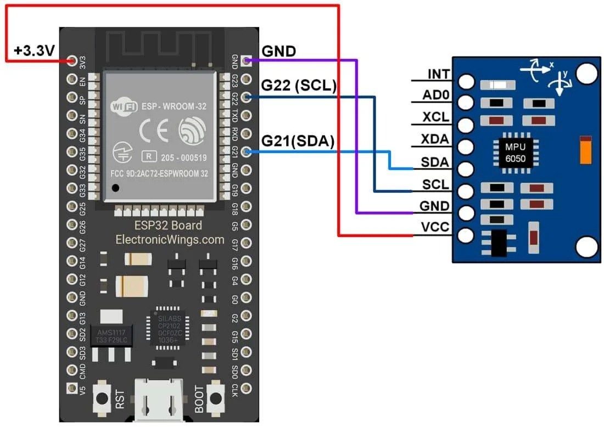
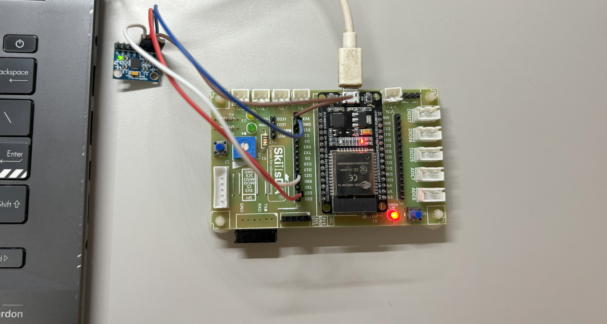
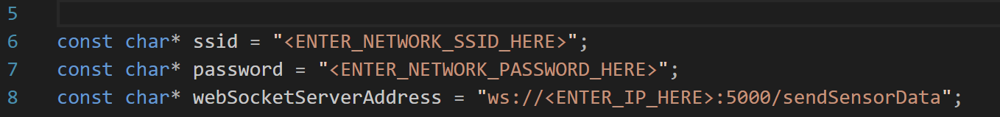
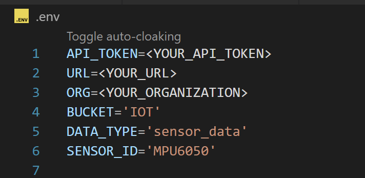

<div align="center" style="display:flex; align-items: center; justify: center; text-decoration: none ">
    <a href="https://github.com/Abhinav-ark/mpu6050_realtime_dashboard/blob/main/LICENSE" target="_blank" rel="noreferrer">
      
    </a>
    <a href="https://github.com/Abhinav-ark/mpu6050_realtime_dashboard" target="_blank" rel="noreferrer">
      
    </a>  
</div>

<h1 align="center">Real Time Dashboard for MPU6050 Accelerometer/Gyroscope</h1>

<div align="center">
    
</div>

This is a web based dashboard for graphical representation of real-time acceleration and rotation data from MPU6050 using websockets. It also records and stores time series sensor data using InfluxDB. Done as a part of `19CSE446 Internet of Things Course`, Department of Computer Science and Engineering, Amrita Vishwa Vidyapeetham, Coimbatore.

## Technologies Used
- [x] `Arduino ESP32`
- [x] `Adafruit`
- [x] `Embedded C`
- [x] `WebSockets`
- [x] `InfluxDB`
- [x] `NodeJS`
- [x] `React`
- [x] `NextJS`
- [x] `Express`
- [x] `MUI React`


<h1 align="center"> UI Screens </h1>

## Real Time Data (Last 20 Readings)
</img>

<br>

## All Time Data
</img>

<br>

## InfluxDB
</img>

<br>

## Video Demonstration
> [!NOTE]
> This video doesn't contain any audio 🔇 

https://github.com/Abhinav-ark/mpu6050_realtime_dashboard/assets/76396917/3185790a-775a-461d-84f0-339fe4695947

<br>

<h1 align="center"> How to setup ? </h1>

- Either clone the repository (or) download the Source Code from the [latest release](https://github.com/Abhinav-ark/mpu6050_realtime_dashboard/releases/tag/v1.0.0).

## Arduino
- Connect the MPU6050 Sensor to the `ESP32 Microcontroller` and connect the Microcontroller to your computer through a USB Cable.

<br>

<div align="center">
    <b>Circuit Diagram</b> (Image Courtesy: ElectronicWings.com)
    <br>
    
    <br>
    <b>DOIT ESP32 DevKit</b>
    <br>
    
</div>

<br>
<br>

- Install all the necessary libraries in Arduino IDE
  - [ArduinoWebockets](https://github.com/gilmaimon/ArduinoWebsockets)
  - [Adafruit_MPU6050](https://github.com/adafruit/Adafruit_MPU6050)
  - [WiFi](https://www.arduino.cc/reference/en/libraries/wifi/)
  - [Wire](https://www.arduino.cc/reference/en/language/functions/communication/wire/)
- Enter the Wifi Network SSID, PASSWORD, IP Address of the Server Computer in which your Backend is Running in The `mpu6050.ino` Arduino File and Upload the code to the board.

<div align="center">
    
</div>

<br>
    
> [!IMPORTANT]  
> It is necessary that both the `ESP32 Microcontroller` and the backend server are connected to the same WiFi Network for the Code to work.

<br>

## Influx DB
- Install [`InfluxDB`](https://www.influxdata.com/downloads/) on your Server Computer (OR) you can use the cloud version also instead.
- Create a user, organisation of your choice and a Bucket named `IOT`.
- Create an API Access Token with Read and Write Permissions to IOT bucket.

<br>

## NodeJS
- In the Server Computer, make sure you have [`nodeJS`](https://nodejs.org/en/download) installed.
- Goto the backend folder and type the following commands to install the dependencies.
```bash
> npm install
```
- Goto the .env file to enter your Environmental Variables, i.e, `INFLUXDB API TOKEN`, `INFLUXDB URL` and `INFLUXDB ORGANISATION`.

<div align="center">
    
</div>

- To run the development server type the following command
```bash
> npm run dev
```
- You can test the websockets server by using the `./TestWebsockets/test.html` document.

## Explanatory Demonstration
> [!NOTE]
> Enable Audio 🔊 for Audio Explanation.

https://github.com/Abhinav-ark/mpu6050_realtime_dashboard/assets/76396917/1300083d-66cc-492d-bfb2-79a4cba5d1e1


# Contributing
Refer to The [Code of Conduct](https://github.com/Abhinav-ark/mpu6050_realtime_dashboard/blob/main/CODE_OF_CONDUCT.md) before making a pull request to the repository, posting on the discussions section or involing in any public activity related to this repository.

# Licensing
All code in this repository is Licensed Under `MIT License`, and is freely available for anyone to use or make changes.

# Security Policy
Refer [SECURITY.md](https://github.com/Abhinav-ark/mpu6050_realtime_dashboard/blob/main/SECURITY.md) for Security Policy.
